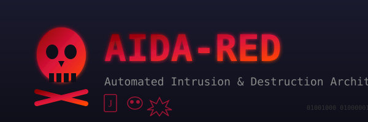

# AIDA-RED: 防御的セキュリティテストフレームワーク

**AIDA-RED** (Automated Intrusion & Destruction Architecture) - AIDAのレッドチーム版

<p align="center">
  
</p>

[English](../../README.md) | 日本語 | [简体中文](README_zh-CN.md) | [繁體中文](README_zh-TW.md) | [Русский](README_ru.md) | [فارسی](README_fa.md) | [العربية](README_ar.md)

> **「壊れるなら、まだ準備ができていなかった。」**

---

## 概要

AIDA-REDは[claude-code-aida](https://github.com/clearclown/claude-code-aida)と連携する**防御的セキュリティテストフレームワーク**です。AIDAが**構築**に専念する一方、AIDA-REDは攻撃者より先に脆弱性を発見するため**破壊**に専念します。

**主要な革新**: AIDA-REDは**Podman/Dockerコンテナ**で**Kali Linux**セキュリティツールを実行し、Claude Codeがオーケストレーションします。Claudeは攻撃コードを書かず、実績のあるオープンソースセキュリティツールを呼び出して結果を分析します。

### 哲学

1. **ゼロトラスト**: すべての入力を攻撃ベクトルと仮定
2. **ゼロモック**: 分離された関数ではなく、実行中のコンテナを攻撃
3. **実績あるツール**: カスタムエクスプロイトではなく、実証済みスキャナー（nuclei, nikto, nmap）を使用
4. **実用的レポート**: すべての発見に再現手順と修正アドバイスを含む

---

## アーキテクチャ

```
┌─────────────────────────────────────────────────────────────────┐
│                        Claude Code                               │
│                    (オーケストレーター & アナリスト)              │
│  ┌─────────────┐  ┌─────────────┐  ┌─────────────┐              │
│  │ /aida:red-  │  │ /aida:red-  │  │ /aida:red-  │              │
│  │    init     │  │   assault   │  │   report    │              │
│  └──────┬──────┘  └──────┬──────┘  └──────┬──────┘              │
└─────────┼────────────────┼────────────────┼─────────────────────┘
          │                │                │
          ▼                ▼                ▼
┌─────────────────────────────────────────────────────────────────┐
│                    Podman / Docker                               │
│  ┌────────────────────────────────────────────────────────────┐ │
│  │              aida-red-scanner (Kali Linux)                 │ │
│  │  ┌─────────┐ ┌─────────┐ ┌─────────┐ ┌─────────┐          │ │
│  │  │ nuclei  │ │  nikto  │ │  nmap   │ │  ffuf   │  ...     │ │
│  │  └─────────┘ └─────────┘ └─────────┘ └─────────┘          │ │
│  └────────────────────────────────────────────────────────────┘ │
│                             │                                    │
│                    aida-red-net (Podmanネットワーク)             │
│                             │                                    │
│  ┌────────────────────────────────────────────────────────────┐ │
│  │                 ターゲットアプリケーション                  │ │
│  │            (AIDAで生成したプロジェクト)                     │ │
│  └────────────────────────────────────────────────────────────┘ │
└─────────────────────────────────────────────────────────────────┘
```

---

## セキュリティツール

AIDA-REDには業界標準のセキュリティツールがプリインストールされています：

| ツール | 目的 | 用途 |
|--------|------|------|
| **[nuclei](https://github.com/projectdiscovery/nuclei)** | テンプレートベース脆弱性スキャナー | CVE検出、設定ミス |
| **[nikto](https://github.com/sullo/nikto)** | Webサーバースキャナー | サーバー設定ミス、古いソフトウェア |
| **[nmap](https://nmap.org/)** | ネットワークスキャナー | ポート検出、サービス特定 |
| **[ffuf](https://github.com/ffuf/ffuf)** | Webファザー | ディレクトリ探索、パラメータファジング |
| **[sslscan](https://github.com/rbsec/sslscan)** | SSL/TLSアナライザー | 証明書問題、弱い暗号 |
| **[sqlmap](https://sqlmap.org/)** | SQLインジェクション検出 | データベース脆弱性（フル版） |
| **[stress-ng](https://github.com/ColinIanKing/stress-ng)** | 負荷テスト | リソース枯渇テスト |

---

## インストール

### 前提条件

- **Podman**（推奨）または **Docker**
- **Claude Code**とAIDAプラグイン

```bash
# Podmanインストール（Ubuntu/Debian）
sudo apt install podman

# またはDocker
sudo apt install docker.io
```

### AIDA-REDインストール

AIDA-REDはAIDAプラグインに含まれています。個別インストール不要です。

```bash
# インストール確認
/aida:red-status
```

### スキャナーイメージビルド

```bash
# Kaliスキャナーコンテナを初期化・ビルド
/aida:red-init

# または軽量版（ビルド高速、ツール少なめ）
/aida:red-init --lite
```

**イメージサイズ:**
- フル版: ~2GB（sqlmap、ZAP CLI含む）
- 軽量版: ~624MB（nuclei、nikto、nmap、ffuf、sslscan）

---

## 使い方

### クイックスタート

```bash
# 1. AIDAでアプリケーションをビルド
/aida "ユーザー認証付きREST APIを作成"

# 2. AIDA-REDスキャナーを初期化
/aida:red-init --lite

# 3. 実行中のアプリに対してセキュリティスキャン実行
/aida:red-assault --target http://localhost:8080

# 4. レポートを確認
/aida:red-report
```

### コマンド

| コマンド | 説明 |
|----------|------|
| `/aida:red-init` | Kaliスキャナーコンテナをビルド、ネットワーク作成 |
| `/aida:red-assault` | ターゲットに対してセキュリティスキャン実行 |
| `/aida:red-status` | スキャナー状態と最近の発見を表示 |
| `/aida:red-report` | 詳細な脆弱性レポートを生成 |
| `/aida:red-cleanup` | コンテナとネットワークを削除 |

### assaultオプション

```bash
# 基本スキャン（標準強度）
/aida:red-assault --target http://localhost:8080

# 最大強度（全ツール）
/aida:red-assault --target http://localhost:8080 --intensity maximum

# 特定ツールのみ
/aida:red-assault --target http://localhost:8080 --tools nuclei,nikto

# AIDAプロジェクトをスキャン（実行中サービス自動検出）
/aida:red-assault --target ../my-aida-project
```

### 強度レベル

| レベル | ツール | 所要時間 |
|--------|--------|----------|
| `minimum` | nuclei、health-check | ~1分 |
| `standard` | nuclei、nikto、nmap、sslscan | ~5分 |
| `maximum` | ffuf、sqlmap含む全ツール | ~15分 |

---

## 出力例

```
AIDA-RED Assault Complete

ターゲット: http://localhost:8080
所要時間: 2分34秒
ツール: nuclei, nikto, nmap, sslscan

発見:
  Critical:  0
  High:      2
  Medium:    5
  Low:       3
  Info:      10

主要な問題:
  [HIGH] 古いTLS設定 - TLS 1.0が有効
  [HIGH] セキュリティヘッダー欠如 - X-Frame-Optionsが未設定
  [MED]  情報漏洩 - ヘッダーにサーバーバージョン
  [MED]  オープンポート - ポート5432（PostgreSQL）が公開
  [MED]  ディレクトリリスティング - /assets/のリスティングが有効

詳細レポート: .aida-red/reports/assault-20260128.json
```

---

## 3人のヴィラン（エージェントペルソナ）

AIDA-REDは異なる攻撃ベクトル専門の3つの「ヴィラン」エージェントを使用：

### The Joker（ロジックファザー）
「技術的には有効だが論理的に破壊的」な入力を生成
- 境界値、巨大ペイロード、Unicode注入
- レースコンディション、整数オーバーフロー
- ツール: `ffuf`、`nuclei`（ファジングテンプレート）

### The Shadow（セキュリティブレイカー）
認可バイパスとデータ漏洩を発見
- IDOR、権限昇格、JWT操作
- SQLインジェクション、認証バイパス
- ツール: `nuclei`、`nikto`、`sqlmap`

### The Chaos（インフラスマッシャー）
コードではなく環境を破壊
- コンテナクラッシュ、ネットワーク分断
- リソース枯渇、モンキーテスト
- ツール: `stress-ng`、`nmap`

---

## AIDA連携

AIDA-REDはAIDAのワークフローと自動連携：

1. **自動トリガー**: AIDA完了時（品質ゲートパス）、セキュリティスキャンを提案

2. **証拠注入**: 発見を`.aida/tdd-evidence/external-bugs/`に書き込み、AIDAの品質ゲートを**失敗**させる

3. **継続ループ**: 脆弱性修正 → AIDA再ビルド → AIDA-RED再スキャン → クリーンになるまで繰り返し

```
AIDAビルド完了
        ↓
AIDA-REDスキャン
        ↓
脆弱性発見? ─── いいえ ───→ 完了！
        │
       はい
        ↓
AIDA証拠に注入
        ↓
AIDA品質ゲート失敗
        ↓
開発者が修正
        ↓
AIDA再ビルド → ループ
```

---

## セキュリティ考慮事項

AIDA-REDは自分のアプリケーションの**防御的セキュリティテスト**用に設計：

- 所有または許可されたアプリケーションのみをスキャン
- 許可なく本番システムに使用しない
- 結果に誤検知が含まれる可能性あり - 発見は手動で検証
- 一部ツール（sqlmap）はデータを変更する可能性あり - 注意して使用

---

## ライセンス

MITライセンス - 責任を持って使用してください。これらのツールの使用方法はあなたの責任です。
