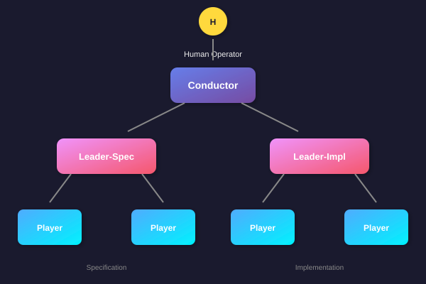
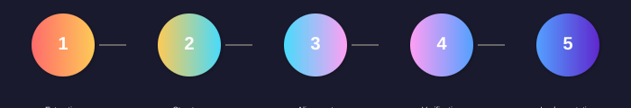
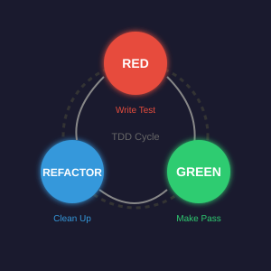

# AIDA 外掛 for Claude Code

**AIDA** (Agent Integration & Development Architecture) - Claude Code 多代理編排框架

[English](../../README.md) | [日本語](README_ja.md) | [简体中文](README_zh-CN.md) | 繁體中文 | [Русский](README_ru.md) | [فارسی](README_fa.md) | [العربية](README_ar.md)

## 概述

AIDA 為軟體開發專案提供多代理編排功能：

- **新專案生成**：從自然語言描述生成完整專案
- **現有專案增強**：為現有專案添加新功能
- **專案維護**：依賴更新、安全審計、品質改進
- **外部專案匯入**：匯入和分析 GitHub/GitLab 儲存庫

<p align="center">
  
</p>

## 快速開始

### 安裝

**一鍵安裝（推薦）**

```bash
curl -fsSL https://raw.githubusercontent.com/clearclown/claude-code-aida/main/scripts/install.sh | bash
```

**手動安裝**

```bash
# 複製儲存庫
git clone https://github.com/clearclown/claude-code-aida.git
cd claude-code-aida

# 執行安裝腳本
./scripts/install.sh
```

**驗證安裝**

```bash
./scripts/test-aida.sh --quick
```

### 基本用法

```bash
# 初始化 AIDA 工作區
/aida:init

# 生成新專案
/aida:pipeline "建立一個 Twitter 複製應用程式"

# 增強現有專案
/aida:enhance /path/to/project "添加使用者認證"

# 查看狀態
/aida:status
```

## 命令

### 專案生成（新專案）

| 命令 | 描述 |
|------|------|
| `/aida:init` | 初始化 AIDA 目錄結構 |
| `/aida:start <描述>` | 啟動新的多代理流水線 |
| `/aida:status` | 顯示當前會話狀態 |
| `/aida:work` | 執行當前階段任務 |
| `/aida:pipeline <描述>` | 執行完全自動化流水線 |

### 現有專案支援

| 命令 | 描述 |
|------|------|
| `/aida:analyze <路徑>` | 分析專案結構、技術棧、品質 |
| `/aida:import <路徑\|URL>` | 匯入外部專案到 AIDA 管理 |
| `/aida:enhance <路徑> [規格]` | 使用文件或自然語言增強專案 |
| `/aida:maintain <路徑> [選項]` | 維護任務（依賴、安全、品質） |

### 維護選項

```bash
# 更新依賴
/aida:maintain /path/to/project --update-deps

# 安全審計
/aida:maintain /path/to/project --security

# 品質改進
/aida:maintain /path/to/project --improve

# 修復失敗的測試
/aida:maintain /path/to/project --fix-tests

# 處理 GitHub Issue
/aida:maintain /path/to/project --issue https://github.com/org/repo/issues/123
```

## 架構

### 代理角色

| 代理 | 角色 |
|------|------|
| **Conductor** | 編排整個流水線，指揮 Leaders |
| **Leader-Spec** | 處理規格階段（需求、設計） |
| **Leader-Impl** | 處理實現階段（基於 TDD 的開發） |
| **Leader-Enhance** | 處理現有專案的增強規格 |
| **Player** | 專業工作者（Backend、Frontend、Docker） |

## 5 階段工作流

<p align="center">
  
</p>

| 階段 | 名稱 | 描述 |
|------|------|------|
| 1 | 提取與架構 | 需求提取、架構設計 |
| 2 | 結構與模式 | 目錄結構、資料模式定義 |
| 3 | 對齊 | 需求一致性檢查 |
| 4 | 驗證 | 計劃驗證、識別修訂 |
| 5 | 實現 | 帶品質門的 TDD 開發 |

## 語言支援

AIDA 自動檢測並支援多種語言：

| 語言 | 檢測方式 | 測試框架 |
|------|----------|----------|
| Go | `go.mod` | `go test` |
| TypeScript/JavaScript | `package.json` | Jest, Vitest |
| Python | `pyproject.toml`, `requirements.txt` | pytest |
| Rust | `Cargo.toml` | `cargo test` |
| Java | `pom.xml`, `build.gradle` | JUnit, Maven/Gradle |
| Ruby | `Gemfile` | RSpec |
| C# | `*.csproj` | dotnet test |
| PHP | `composer.json` | PHPUnit |

## 品質門

### 新專案門（10 個門）

| 門 | 名稱 | 驗證 |
|----|------|------|
| 1 | 後端建構 | `go build ./...` |
| 2 | 後端測試 | `go test ./...` |
| 3 | 前端建構 | `npm run build` |
| 4 | 前端測試 | `npm test -- --run` |
| 5 | Docker 建構 | `docker compose build` |
| 6 | Docker 執行 | `docker compose up -d` |
| 7 | 健康檢查 | `curl localhost:8080/health` |
| 8 | API 覆蓋 | 3+ 處理器檔案，10+ 函數 |
| 9 | 前端覆蓋 | 3+ 頁面，路由，API 客戶端 |
| 10 | 整合 | API 客戶端，CORS，Docker 連結 |

## TDD 協議

<p align="center">
  
</p>

所有實現遵循嚴格的 TDD：

1. **RED**：首先編寫失敗的測試
2. **GREEN**：編寫最少程式碼使測試通過
3. **REFACTOR**：在測試通過的情況下清理程式碼

沒有測試就沒有程式碼。不執行測試就沒有測試。

## 腳本

| 腳本 | 描述 |
|------|------|
| `scripts/install.sh` | 一鍵安裝 |
| `scripts/test-aida.sh` | AIDA 自測 |
| `scripts/quality-gates.sh` | 新專案品質門 |
| `scripts/enhance-quality-gates.sh` | 增強品質門 |
| `scripts/analyze-project.sh` | 專案分析 |
| `scripts/checkpoint.sh` | 儲存/恢復會話狀態 |

## 容器執行環境

AIDA 同時支援 Docker 和 Podman：

```bash
# 自動檢測 podman 或 docker

# 強制使用 Podman
export DOCKER_HOST="unix:///run/user/$(id -u)/podman/podman.sock"
./scripts/quality-gates.sh myproject
```

## 授權

MIT

## 致謝與鳴謝

### 核心技術

| 專案 | 作者 | 角色 |
|------|------|------|
| [zoltraak](https://github.com/dai-motoki/zoltraak) | [@dai-motoki](https://github.com/dai-motoki) | 需求生成 |
| [cc-sdd](https://github.com/gotalab/cc-sdd) | [@gotalab](https://github.com/gotalab) | 規格驅動開發 |
| [claude-code-harness](https://github.com/Chachamaru127/claude-code-harness) | [@Chachamaru127](https://github.com/Chachamaru127) | TDD 框架 |
| orchestrobot (aida-cli) | [@kent8192](https://github.com/kent8192) | 多代理編排 |

### 基礎設施

| 專案 | 授權 |
|------|------|
| [Claude Code](https://github.com/anthropics/claude-code) | Anthropic |
| [Redis](https://redis.io/) | BSD-3-Clause |
| [tmux](https://github.com/tmux/tmux) | ISC |
| [Podman](https://podman.io/) | Apache 2.0 |

### 特別感謝

- [Anthropic](https://www.anthropic.com/) - Claude 的創造者
- 所有幫助改進此專案的貢獻者和測試者

## 連結

- [GitHub 儲存庫](https://github.com/clearclown/claude-code-aida)
- [Issues](https://github.com/clearclown/claude-code-aida/issues)
